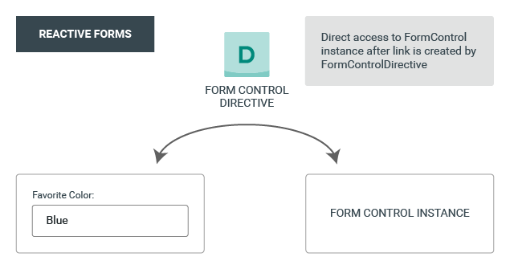

# Forms in Angular

**Reactive forms** are more robust: they're more scalable, reusable, and testable. If forms are a key part of your application, or you're already using reactive patterns for building your application, use reactive forms.

**Template-driven forms** are useful for adding a simple form to an app, such as an email list signup form. They're easy to add to an app, but they don't scale as well as reactive forms. If you have very basic form requirements and logic that can be managed solely in the template, use template-driven forms.

## Common foundation

Both reactive and template-driven forms share underlying building blocks.

* **FormControl** tracks the value and validation status of an individual form control.

* **FormGroup** tracks the same values and status for a collection of form controls.

* **FormArray** tracks the same values and status for an array of form controls.

* **ControlValueAccessor** creates a bridge between Angular FormControl instances and native DOM elements.




## Data flow in forms

Reactive and template-driven forms follow two different strategies when handling form input.

## Template driven forms

``` html
<form #heroForm="ngForm">
```

The NgForm directive
What NgForm directive? You didn't add an NgForm directive.

Angular did. Angular automatically creates and attaches an NgForm directive to the \<form> tag.

The NgForm directive supplements the form element with additional features. It holds the controls you created for the elements with an ngModel directive and name attribute, and monitors their properties, including their validity. It also has its own valid property which is true only if every contained control is valid.

Notice that you also added a name attribute to the \<input> tag and set it to "name", which makes sense for the hero's name. Any unique value will do, but using a descriptive name is helpful. Defining a name attribute is a requirement when using [(ngModel)] in combination with a form.

Internally, Angular creates FormControl instances and registers them with an NgForm directive that Angular attached to the \<form> tag. Each FormControl is registered under the name you assigned to the name attribute. Read more in the previous section, The NgForm directive.

Each input element has a name property that is required by Angular forms to register the control with the form.

## Reactive Forms

### Dynamic controls using form arrays

FormArray is an alternative to FormGroup for managing any number of unnamed controls. As with form group instances, you can dynamically insert and remove controls from form array instances, and the form array instance value and validation status is calculated from its child controls. However, **you don't need to define a key for each control by name**, so this is a great option if you don't know the number of child values in advance. The following example shows you how to manage an array of aliases in ProfileEditor.

Listed below are the base classes and services used to create and manage form controls.

## Classes

Class Description

#### AbstractControl

The abstract base class for the concrete form control classes FormControl, FormGroup, and FormArray. It provides their common behaviors and properties.

#### FormControl

Manages the value and validity status of an individual form control. It corresponds to an HTML form control such as \<input> or \<select>.

#### FormGroup

Manages the value and validity state of a group of AbstractControl instances. The group's properties include its child controls. The top-level form in your component is FormGroup.

#### FormArray

Manages the value and validity state of a numerically indexed array of AbstractControl instances.

FormBuilder
An injectable service that provides factory methods for creating control instances.

### Directives

Directive	Description
#### FormControlDirective

Syncs a standalone FormControl instance to a form control element.

#### FormControlName

Syncs FormControl in an existing FormGroup instance to a form control element by name.

#### FormGroupDirective

Syncs an existing FormGroup instance to a DOM element.

#### FormGroupName

Syncs a nested FormGroup instance to a DOM element.

#### FormArrayName

Syncs a nested FormArray instance to a DOM element.

## Custom validators

``` typescript
/** A hero's name can't match the given regular expression */
export function forbiddenNameValidator(nameRe: RegExp): ValidatorFn {
  return (control: AbstractControl): {[key: string]: any} | null => {
    const forbidden = nameRe.test(control.value);
    return forbidden ? {'forbiddenName': {value: control.value}} : null;
  };
}
```

The function is actually a factory that takes a regular expression to detect a specific forbidden name and returns a validator function.

In this sample, the forbidden name is "bob", so the validator will reject any hero name containing "bob". Elsewhere it could reject "alice" or any name that the configuring regular expression matches.

The forbiddenNameValidator factory returns the configured validator function. That function takes an Angular control object and returns either null if the control value is valid or a validation error object. The validation error object typically has a property whose name is the validation key, 'forbiddenName', and whose value is an arbitrary dictionary of values that you could insert into an error message, {name}.

Custom async validators are similar to sync validators, but they must instead return a Promise or Observable that later emits null or a validation error object. In the case of an Observable, the Observable must complete, at which point the form uses the last value emitted for validation.

### Adding to reactive forms

``` typescript
this.heroForm = new FormGroup({
  'name': new FormControl(this.hero.name, [
    Validators.required,
    Validators.minLength(4),
    forbiddenNameValidator(/bob/i) // <-- Here's how you pass in the custom validator.
  ]),
  'alterEgo': new FormControl(this.hero.alterEgo),
  'power': new FormControl(this.hero.power, Validators.required)
});
```

### Adding to template-driven forms

In template-driven forms, you don't have direct access to the FormControl instance, so you can't pass the validator in like you can for reactive forms. Instead, you need to add a directive to the template.

The corresponding ForbiddenValidatorDirective serves as a wrapper around the forbiddenNameValidator.

Angular recognizes the directive's role in the validation process because the directive registers itself with the NG_VALIDATORS provider, a provider with an extensible collection of validators.

The directive class then implements the Validator interface, so that it can easily integrate with Angular forms. Here is the rest of the directive to help you get an idea of how it all comes together:

shared/forbidden-name.directive.ts (providers)

``` typescript
@Directive({
  selector: '[appForbiddenName]',
  providers: [{provide: NG_VALIDATORS, useExisting: ForbiddenValidatorDirective, multi: true}]
})
export class ForbiddenValidatorDirective implements Validator {
  @Input('appForbiddenName') forbiddenName: string;

  validate(control: AbstractControl): {[key: string]: any} | null {
    return this.forbiddenName ? forbiddenNameValidator(new RegExp(this.forbiddenName, 'i'))(control)
                              : null;
  }
}
```

Once the ForbiddenValidatorDirective is ready, you can simply add its selector, appForbiddenName, to any input element to activate it. For example:

``` html
<input id="name" name="name" class="form-control"
      required minlength="4" appForbiddenName="bob"
      [(ngModel)]="hero.name" #name="ngModel" >
```

